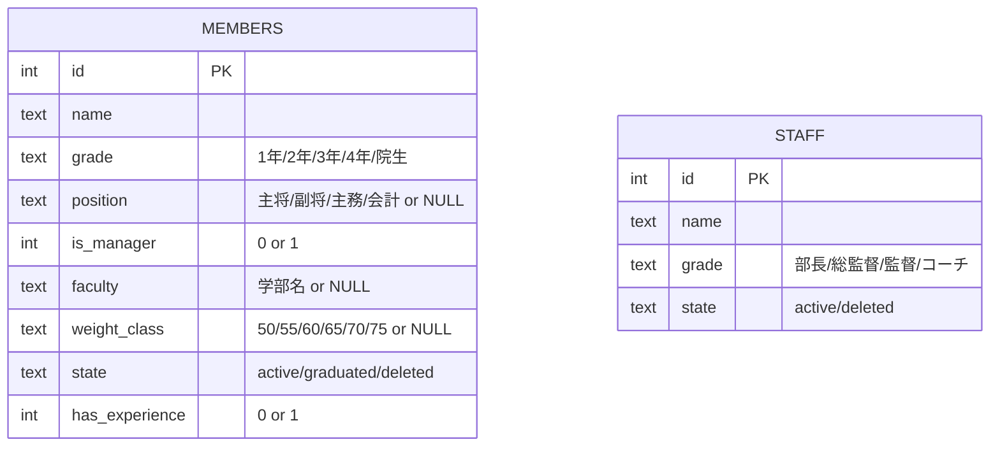

# 近畿大学体育会ボクシング部 公式サイト — プロジェクトドキュメント

> このドキュメントは **AI アシスタントが参照してパフォーマンスを上げる** ことを主目的に書かれています。
> 人間の開発者にとっても有用ですが、AI が「このプロジェクトでは何がどうなっているか」を高速に把握できることを優先しています。

---

## 1. プロジェクト概要

| 項目 | 内容 |
|---|---|
| サイト名 | 近畿大学体育会ボクシング部 公式ウェブサイト |
| 本番URL | `https://kindai-boxing.com` |
| リポジトリ | 個人開発（プライベート） |
| ページ構成 | 公開サイト（LP形式のシングルページ）＋ 管理画面 |

### サイトの役割
- **公開サイト**: 部の紹介、部員・スタッフ一覧、活動内容、部員募集（CTA）、Instagram連携
- **管理画面**: 部員・スタッフデータの CRUD 管理（進級・卒業・退部の一括処理含む）

---

## 2. 技術スタック

| カテゴリ | 技術 | バージョン | 備考 |
|---|---|---|---|
| フレームワーク | Next.js (App Router) | 15.0.3 | React RC版 (19.0.0-rc) |
| 言語 | TypeScript | ^5 | strict モード |
| スタイリング | Tailwind CSS | v4 | `@tailwindcss/postcss` 使用 |
| アニメーション | Framer Motion | ^12 | - |
| ホスティング | Cloudflare Pages | - | `@cloudflare/next-on-pages` でビルド |
| ランタイム | Cloudflare Workers (Edge) | - | `export const runtime = "edge"` |
| データベース | Cloudflare D1 (SQLite) | - | バインディング名: `DB` |
| ストレージ | Cloudflare R2 | - | バインディング名: `STORAGE` |
| CSS ユーティリティ | clsx + tailwind-merge | - | クラス結合用 |
| アイコン | react-icons | ^5 | - |

### 重要な制約
- **Edge Runtime 必須**: `node:*` モジュール（`fs`, `crypto` 等）は使用不可。`bcrypt` などの Node.js ネイティブモジュールも使えない。
- **`getRequestContext()`**: Cloudflare のバインディング（D1, R2）へのアクセスは `@cloudflare/next-on-pages` の `getRequestContext()` 経由。

---

## 3. ディレクトリ構成

```
kindai-boxing-club-site/
├── app/
│   ├── (public)/              # 公開サイト（Route Group）
│   │   ├── layout.tsx         # ルートレイアウト（メタデータ、フォント、Nav/Footer）
│   │   ├── page.tsx           # トップページ（セクションを並べる）
│   │   └── globals.css        # グローバルCSS（@theme, @utility, @layer）
│   └── (admin)/               # 管理画面（Route Group）
│       └── admin/
│           ├── layout.tsx     # 管理画面レイアウト
│           ├── page.tsx       # 管理画面トップ
│           ├── [entity]/      # 動的ルート（members/staff）
│           └── members/       # メンバー固有ページ
├── components/
│   ├── public/                # 公開サイト用コンポーネント
│   │   ├── hero/              # ヒーローセクション
│   │   ├── layout/            # Navigation, Footer, MobileMenu
│   │   ├── members/           # 部員・スタッフ表示
│   │   ├── recruit/           # 募集セクション
│   │   ├── sections/          # 各セクション（ClubIntro, Message, Activity, Instagram）
│   │   └── ui/                # 共通UI（SectionHeading, PersonImage, PositionBadge 等）
│   └── admin/                 # 管理画面用コンポーネント
│       ├── PersonTable.tsx    # メインの編集テーブル
│       ├── AdminEntityView.tsx
│       ├── InputCell.tsx, InputRow.tsx
│       ├── useEditableRows.ts # 編集状態管理のカスタムフック
│       └── ...
├── lib/
│   ├── db/                    # データアクセス層
│   │   ├── client.ts          # D1クライアント（query, execute ヘルパー）
│   │   ├── member.repository.ts
│   │   ├── staff.repository.ts
│   │   ├── person.repository.ts  # 共通操作（remove, restore, eliminate）
│   │   └── person.mock.ts     # モックデータ（D1未接続時のフォールバック）
│   ├── storage/               # R2ストレージ層
│   │   ├── client.ts          # R2 URLヘルパー
│   │   └── image.repository.ts # 画像URL生成
│   ├── service/               # ビジネスロジック層
│   │   ├── person.service.ts  # Member/Staff の取得・グループ化・CRUD
│   │   └── image.service.ts
│   ├── actions/               # Next.js Server Actions
│   │   └── person.action.ts   # CRUD + revalidatePath
│   ├── admin/                 # 管理画面設定
│   │   ├── entity.config.ts   # テーブル列定義の型
│   │   ├── member.config.ts   # Memberテーブルの列定義
│   │   └── staff.config.ts    # Staffテーブルの列定義
│   ├── constants.ts           # 定数（学年、役職、階級、学部リスト）
│   └── fonts.ts               # フォント設定（※後述のワークアラウンド参照）
├── types/
│   └── index.ts               # 型定義（Person, Member, Staff, GroupedMember 等）
├── docs/
│   ├── PROJECT.md             # ← このファイル
│   └── database_guide.md      # DBスキーマ・運用ガイド
├── public/images/             # 静的画像アセット
├── wrangler.json              # Cloudflare設定（D1, R2バインディング）
├── next.config.ts             # Next.js設定
└── env.d.ts                   # CloudflareEnv 型定義
```

---

## 4. アーキテクチャ

### レイヤー構成

```
Component (RSC / Client)
    ↓ props or import
Server Action (lib/actions/)     ← "use server" + revalidatePath
    ↓
Service (lib/service/)           ← ビジネスロジック（グループ化、フォールバック等）
    ↓
Repository (lib/db/, lib/storage/) ← 純粋なデータアクセス
    ↓
Cloudflare D1 / R2               ← getRequestContext() 経由
```

### データフロー: 公開サイト
1. `page.tsx` (RSC) が `person.service` を直接呼び出す
2. `person.service` → `member.repository` → D1 に SQL 発行
3. D1 未接続時（`npm run dev`）は **モックデータ** にフォールバック
4. 取得データを `groupMembers()` でグループ化し、各セクションコンポーネントに props で渡す

### データフロー: 管理画面
1. `page.tsx` (RSC) がデータ取得→ テーブルコンポーネントに渡す
2. ユーザー操作 → Client Component の `useEditableRows` で状態管理
3. 保存時 → Server Action（`person.action.ts`）→ Service → Repository → D1
4. `revalidatePath` で画面を更新

### モックデータ戦略
- `lib/db/person.mock.ts` にハードコードされたモックデータ
- Service 層で「DB から取得した結果が空配列」の場合にフォールバック
- `npm run dev`（通常の Next.js dev server）ではD1に接続しないため、常にモックが使われる
- D1 接続してテストするには `npm run dev:remote`（ビルド → wrangler pages dev）

---

## 5. デザインシステム

### カラーパレット

| トークン名 | 値 | 用途 |
|---|---|---|
| `--color-base-black` | `#0a0a0a` | テキスト・背景 |
| `--color-base-white` | `#fafafa` | 背景 |
| `--color-accent-red` | `#c00000` | アクセントカラー（ボクシング = 赤） |

> Tailwind v4 の `@theme` ブロックで定義。 `bg-base-black`, `text-accent-red` 等で参照可能。

### フォント

| トークン名 | フォント | 用途 |
|---|---|---|
| `--font-sans` (デフォルト) | Noto Sans JP | 本文・UIテキスト全般 |
| `--font-inter` | Inter | 英字の見出し・数字 |
| `--font-shippori` | Shippori Mincho | 和風の見出し・引用（明朝体） |
| `--font-zen-antique` | Zen Antique | 特殊な装飾テキスト |

> **読み込み方式**: Google Fonts を CSS の `@import url(...)` でブラウザロード。
> Next.js の `next/font` は WSL ビルド時にタイムアウトするため使用していない（`lib/fonts.ts` は空のスタブ）。

### カスタムユーティリティ

| クラス名 | 効果 |
|---|---|
| `text-gradient` | 黒→赤のグラデーションテキスト |
| `boxing-pattern` | 斜め45度ストライプの背景パターン |
| `animate-gradient-xy` | 背景グラデーションのアニメーション |

### コンポーネントスタイリング規約
- Tailwind CSS のユーティリティクラスを使用
- 動的クラスの結合は `clsx` + `tailwind-merge` を使用
- セクション共通の見出しは `SectionHeading` コンポーネント
- 人物カードは `PersonCard` + `PersonImage` + `PositionBadge`

---

## 6. データモデル

### ER 図（概念）



### 画像の管理
- R2 に `/{members|staff}/{id}.webp` のパスで保存
- 公開URL: `https://storage.kindai-boxing.com/{members|staff}/{id}.webp`
- 画像URLの生成は `lib/storage/image.repository.ts` の `getPersonImageUrl()` が担当

#### 画像の推奨スペック
| 項目 | 値 |
|---|---|
| アスペクト比 | 3:4（縦長） |
| 推奨解像度 | 600x800px |
| ファイル形式 | WebP（推奨）または JPG |
| ファイルサイズ | 1枚あたり 100KB 以下 |

---

## 7. 開発フロー

### コマンド一覧

| コマンド | 用途 | URL |
|---|---|---|
| `npm run dev` | 通常のローカル開発（D1未接続、モックデータ） | `http://localhost:3000` |
| `npm run dev:remote` | ビルド → wrangler pages dev（D1/R2接続あり） | `http://localhost:8788` |
| `npm run pages:build` | Cloudflare Pages 向けビルド | - |
| `npm run lint` | ESLint | - |

### データベース設定

`wrangler.json` で D1 データベースを切り替え：

| 環境 | DB名 | 備考 |
|---|---|---|
| 本番用 | `kindai-boxing-db` | 通常はこちら |
| テスト用 | `boxing-club-test` | `database_id` を書き換えて使用 |

> D1スキーマ・運用ルールの詳細は [データベース運用ガイド](./database_guide.md) を参照

### デプロイ
- GitHub → Cloudflare Pages の自動デプロイ
- ビルドコマンド: `npx @cloudflare/next-on-pages`

### 環境変数

| 変数名 | 定義場所 | 用途 |
|---|---|---|
| `NEXT_PUBLIC_R2_BASE_URL` | `wrangler.json` の `vars` | R2 の公開ベースURL |
| `DB` | Cloudflare バインディング | D1 データベース |
| `STORAGE` | Cloudflare バインディング | R2 バケット |

---

## 8. 既知の制約とワークアラウンド

### ⚠️ フォントの読み込み方式
- **問題**: WSL 環境で `next/font/google` がビルド時にタイムアウトする
- **対処**: `globals.css` の `@import url(...)` でブラウザから直接ロード
- **影響**: `lib/fonts.ts` は空のスタブ（`{ variable: "", className: "" }`）だが、`layout.tsx` が import しているため削除しないこと
- **注意**: `<body>` に font の variable クラスが設定されるが、実際は空文字なので影響なし

### ⚠️ D1 接続とモックのフォールバック
- `npm run dev` では D1 に接続しないため、Service 層が自動的にモックデータを返す
- フォールバック条件は「取得結果が空配列」なので、本番DBに `active` なレコードが0件の場合もモックが表示される点に注意

### ⚠️ Edge Runtime 制約
- `node:*` モジュール使用不可
- `bcrypt` 等の C++ ネイティブバインディング使用不可（Web Crypto API を使うこと）
- ファイルシステムへのアクセス不可

### ⚠️ wrangler.json の `"remote": true`
- D1・R2 ともに `"remote": true` が設定されている
- ローカル開発（`wrangler pages dev`）でも **本番DB/R2 に直接接続** される
- ローカルのエミュレートDBを使いたい場合は `"remote": false` に変更する

---

## 9. コーディング規約

### ファイルの先頭コメント
- 各ファイルの先頭に `/** ○○ */` 形式で役割を記述するパターンが確立されている
- 新規ファイルでもこのパターンに従うこと

### 型定義
- アプリ全体の型は `types/index.ts` に集約
- 定数（学年・役職・学部等）は `lib/constants.ts` に `as const` で定義し、型は `typeof` で導出

### ディレクトリルール
- `lib/db/` — 純粋なデータアクセス（SQL を直接書く）
- `lib/service/` — ビジネスロジック（データの加工・集約）
- `lib/actions/` — Server Actions（`"use server"` + `revalidatePath`）
- `components/` — `public/` と `admin/` で分離

### 管理画面の設定駆動パターン
- テーブルの列定義は `lib/admin/{entity}.config.ts` で設定オブジェクトとして定義
- `PersonTable` コンポーネントがこの設定を受け取って汎用的にレンダリング
- 新しいエンティティを追加する場合は、config を作成して `[entity]` 動的ルートで対応

---

## 10. 新機能追加時のチェックリスト

1. **型定義** → `types/index.ts` に追加
2. **定数** → `lib/constants.ts` に追加（必要な場合）
3. **Repository** → `lib/db/` に SQL を書く
4. **Service** → `lib/service/` にビジネスロジック
5. **Server Action** → `lib/actions/` に `"use server"` 関数
6. **Component** → `components/{public|admin}/` に配置
7. **Route** → `app/(public|admin)/` にページ追加
8. **Edge Runtime** → `export const runtime = "edge"` を忘れずに
9. **モック** → D1未接続時のフォールバックを考慮
